```{r setup, include=FALSE}
knitr::opts_chunk$set(echo = FALSE, message = FALSE, warning = FALSE)
```


<!-- Estilos elegantes con GIF dinámico en los títulos -->
<style>
@import url('https://fonts.googleapis.com/css2?family=Open+Sans:wght@400;600&display=swap');

body {
  font-family: 'Open Sans', sans-serif;
}

.titulo-dinamico {
  background-image: url('https://media.giphy.com/media/7FrOU9tPbgAZtxV5mb/giphy.gif');
  background-size: cover;
  background-position: center;
  color: white;
  font-size: 38px;
  font-weight: bold;
  text-align: center;
  padding: 40px 20px;
  border-radius: 10px;
  margin-bottom: 20px;
  text-shadow: 2px 2px 6px rgba(0, 0, 0, 0.7);
}

.texto-limpio {
  max-width: 900px;
  margin: 0 auto 40px auto;
  font-size: 18px;
  line-height: 1.7;
  text-align: justify;
  color: #222;
}
</style>

<div class="titulo-dinamico">BIENVENIDA</div>

<div class="texto-limpio">
Sean bienvenidos a nuestra página web. Esperamos que el contenido que preparamos para ustedes sea de mucha utilidad. Preparate para entrar al mundo blockchain y, ¿por qué no?, aprender a utilizarla para tu beneficio y ¡hasta comprar cryptomonedas! :D
</div>

---

<div class="titulo-dinamico">INTRODUCCIÓN</div>

<div class="texto-limpio">
> Este sitio fue creado como parte de un proyecto académico, para la materia de Métodos Cuántitativos aplicados a la Administración, impartida en el Posgrado de la Facultad de Contaduría y Administración de la Universidad Nacional Autónoma de México.

> Parte del análisis realizado fue gracias a los conocimientos adquiridos por el distinguido Dr. Carlos Rodríguez Contreras, quien imparte la materia antes mecionada.

**>> -  Si lo deseas, puedes explorar esta página web navegando desde el menú ubicado en la parte superior izquierda o, si lo prefieres, desplázate hacia abajo para interactuar con las diferentes secciones y pestañas que hemos preparado para tí.**
</div>

---

## Contenido General {.tabset}

### ¿Qué es la tecnología Blockchain?

####  **¿Qué es la tecnología Blockchain?**


La tecnología **blockchain** es una tecnología de registro distribuido que permite almacenar información de manera segura, transparente e inmutable. Cada bloque incluye un conjunto de transacciones y se conecta al bloque anterior a través de técnicas criptográficas, formando así una cadena. Esta estructura asegura que los datos no puedan ser modificados sin el consenso de la red.

Según IBM, la blockchain es "un libro mayor digital compartido e inmutable que facilita el proceso de registrar transacciones y rastrear activos en una red empresarial".

**La descentralización es una de las características más importantes de la tecnología blockchain**, ya que elimina la necesidad de intermediarios y permite que las transacciones se realicen directamente entre pares. Esto no solo mejora la eficiencia, sino que también reduce costos y aumenta la seguridad.


Blockchain es una tecnología de registro distribuido que permite almacenar información de forma segura, transparente e inmutable. Cada bloque está encadenado al anterior y contiene información verificable. A continuación se muestra un ejemplo de lo que sucede en cada transacción.

```{r}
data.frame(
  Bloque = 1:3,
  Contenido = c("Transacción A-B", "Transacción C-D", "Transacción E-F"),
  Hash = c("abc123", "def456", "ghi789")
)
```


---

### Minería de Bitcoin

La minería de Bitcoin es el proceso que permite validar nuevas transacciones y añadirlas a la cadena de bloques (blockchain). Al mismo tiempo, es la forma en que se crean nuevos bitcoins que entran en circulación.

####    **¿Qué hacen los mineros?**
  
Los mineros están en una competencia constante para resolver un complicado problema criptográfico, conocido como el problema del hash. El primero en resolverlo:

- Agrupa las transacciones más recientes en un bloque.
- Añade ese bloque a la cadena existente.
- Recibe una recompensa en bitcoins (actualmente 6.25 BTC por bloque, aunque esta cifra se reduce cada cuatro años en un evento llamado halving).

Este sistema de recompensas motiva a los mineros a mantener la red en funcionamiento.

####     **¿Qué problema resuelven?**
   
   
El desafío consiste en encontrar un número aleatorio (llamado nonce) que, al ser procesado por una función hash junto con los datos del bloque, produzca un resultado con ciertas características, como comenzar con una cantidad específica de ceros.

Este proceso utiliza SHA-256, un algoritmo criptográfico que genera una “huella digital” única e irrepetible.


*Fuente: https://www.bitpanda.com/academy/es/lecciones/que-es-la-mineria-de-bitcoin-y-como-funciona-la-mineria/*


---


### ¿Cómo se realizan las transacciones en Bitcoin?


>**1. Creación de la Transacción**


El usuario inicia una transacción especificando:

- *La dirección de destino.
- *La cantidad de BTC a enviar.
- *Las claves públicas y firmas digitales necesarias.


Esta información se estructura en una transacción que será transmitida a la red.

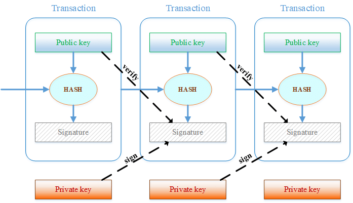


>**2. Transmisión y Verificación por los Nodos**


Una vez creada, la transacción se transmite a la red Bitcoin, donde es recibida por múltiples nodos. Cada nodo verifica:

- *La validez de la firma digital.
- *Que el remitente tiene suficientes fondos.
- *Que no se trata de un doble gasto.

Si la transacción es válida, se propaga al resto de la red.

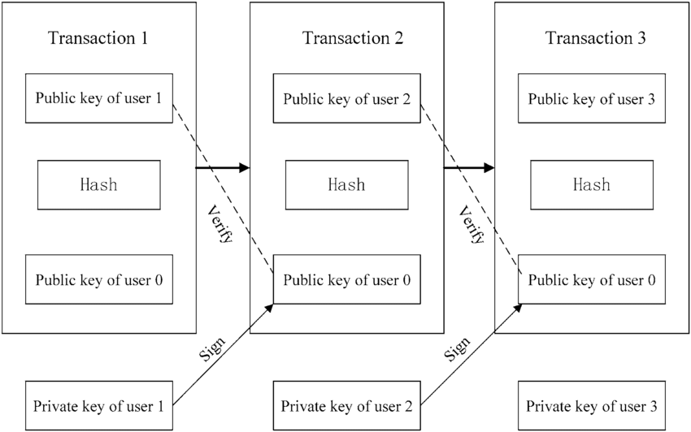


>**3. Inclusión en un Bloque**


Las transacciones verificadas se agrupan en un bloque por los mineros. Cada bloque contiene:

- *Un encabezado con información del bloque anterior.
- *Una raíz de Merkle que resume todas las transacciones.
- *Un nonce que será ajustado durante el proceso de minería.

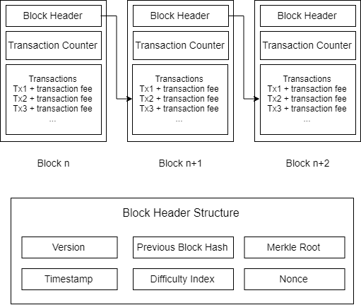

>**4. Minería y Prueba de Trabajo (Proof-of-Work)**

Los mineros compiten para encontrar un valor de nonce que, al ser combinado con el contenido del bloque y pasado por la función hash SHA-256, produzca un hash que cumpla con ciertas condiciones de dificultad. Este proceso se conoce como Prueba de Trabajo.


El primer minero en encontrar una solución válida transmite el bloque a la red.

>**5. Confirmación y Seguridad de la Transacción**

Una vez que el bloque es aceptado por la red, la transacción se considera confirmada. Cada bloque adicional que se añade a la cadena aumenta la seguridad de la transacción, ya que modificar una transacción requeriría rehacer la Prueba de Trabajo de ese bloque y de todos los siguientes.


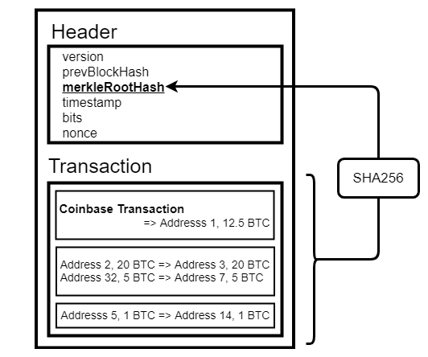


### ¿Por qué es tan segura esta tecnología?


>**¿Por qué es tan segura esta tecnología?**


La seguridad de Bitcoin se basa en tres pilares principales:

####  **1. Descentralización**

Miles de nodos distribuidos por el mundo verifican las transacciones. No hay un único punto de falla ni autoridad central que pueda ser hackeada o manipulada.

####  **2. Inmutabilidad mediante criptografía**

Cada bloque contiene una firma (hash) del bloque anterior. Si alguien intenta modificar un bloque, todos los bloques siguientes quedarían inválidos, y el cambio sería rechazado por los nodos.

####  **3. Prueba de trabajo (Proof of Work) **

Modificar un bloque implicaría rehacer el trabajo de todos los bloques posteriores, lo cual requeriría un poder computacional inmenso que haría el ataque prácticamente imposible (y económicamente inviable).

Además, los incentivos económicos están diseñados para recompensar el comportamiento honesto y penalizar el malicioso. Por ejemplo, si un minero intenta validar una transacción inválida, no ganará la recompensa.


####  **En resumen:**

- La minería asegura que todas las transacciones estén ordenadas y validadas de forma descentralizada.

- Las transacciones se verifican criptográficamente, sin necesidad de intermediarios.

- La red se protege a sí misma gracias al consenso distribuido y la dificultad ajustable del trabajo requerido.


### Quiénes usan Blockchain

```{r}
library(ggplot2)
apps <- data.frame(
  Categoria = c("Finanzas", "Salud", "Logística", "Gobierno", "Otros"),
  Porcentaje = c(45, 20, 15, 10, 10)
)
ggplot(apps, aes(x = Categoria, y = Porcentaje, fill = Categoria)) +
  geom_col(show.legend = FALSE) +
  theme_minimal() +
  ggtitle("Distribución de Aplicaciones de Blockchain")
```


> **1. Sector financiero (Finanzas)**

% de uso estimado: 45%
Este fue el primer sector en adoptar masivamente la blockchain.

 Aplicaciones principales:
Transferencias internacionales sin bancos intermediarios (Ripple, Stellar).

Pagos descentralizados (Bitcoin, stablecoins como USDC).

Plataformas de préstamos y DeFi (Aave, Compound).

Liquidación de activos tokenizados (acciones, bonos, fondos).

Según Tapscott & Tapscott (2016), “la blockchain reducirá los costos de intermediación financiera y cambiará radicalmente el rol de los bancos, bolsas y aseguradoras” (p. 104).

>**2.  Sector salud (Salud)**

% de uso estimado: 20%
El sector salud busca mejorar la seguridad y la interoperabilidad de los datos médicos.

Aplicaciones principales:
Historia clínica electrónica inmutable (Ej. MedRec – MIT).

Cadena de suministro de medicamentos: evita falsificaciones.

Consentimiento del paciente registrado de forma descentralizada.

Pruebas de laboratorio y vacunación certificadas en blockchain.

Como señala Swan (2015), “la blockchain puede ofrecer un sistema de identidad médica portátil, verificable y seguro, accesible globalmente” (p. 95).

> **3. Sector logístico y cadena de suministro**

% de uso estimado: 15%
Las cadenas logísticas globales requieren integridad, trazabilidad y auditoría de procesos.

 Aplicaciones principales:
Seguimiento de productos desde el origen (IBM Food Trust).

Certificados de origen y calidad inmutables.

Automatización de pagos y entregas con smart contracts.

Reducción de fraudes y errores humanos.

Blockchain Revolution destaca cómo Maersk y Walmart utilizan blockchain para reducir costos, detectar fraudes y mejorar la trazabilidad en cadenas alimentarias y portuarias (Tapscott & Tapscott, 2016, p. 148).

> **4. Sector público y gobierno**

% de uso estimado: 10%

 Aplicaciones principales:
Votación electrónica segura (Ej. Estonia, Sierra Leona).

Identidad digital soberana (blockchain para documentos oficiales).

Gestión de registros públicos: tierras, vehículos, licencias.

Transparencia y auditoría presupuestaria automatizada.

Según Mougayar (2016), “los gobiernos pueden adoptar blockchain para reducir la corrupción, mejorar la eficiencia de servicios y devolver el control de los datos a los ciudadanos” (p. 143).

> **5.  Otros sectores emergentes (10%)**
Incluyen:
Arte y cultura: mediante NFTs (artistas y músicos).

Educación: certificados académicos verificados en blockchain.

Energía: redes descentralizadas de energía entre pares (Ej. Power Ledger).

Inmobiliario: compraventa de propiedades tokenizadas.

Gaming: propiedad de activos digitales (como en Decentraland).


> > > **A continuación se presenta un resumen de usos por sector*


```{r}
library(knitr)
kable(
  data.frame(
    Área = c("Finanzas", "Gobierno", "Salud"),
    Uso = c("Pagos, criptomonedas", "Votaciones, registros públicos", "Historia clínica inmutable")
  ),
  caption = "**Resumen de usos por sector**"
)
```


### WHITEPAPER

> **WHITEPAPER DE BITCOIN - SATOSHI NAKAMOTO**


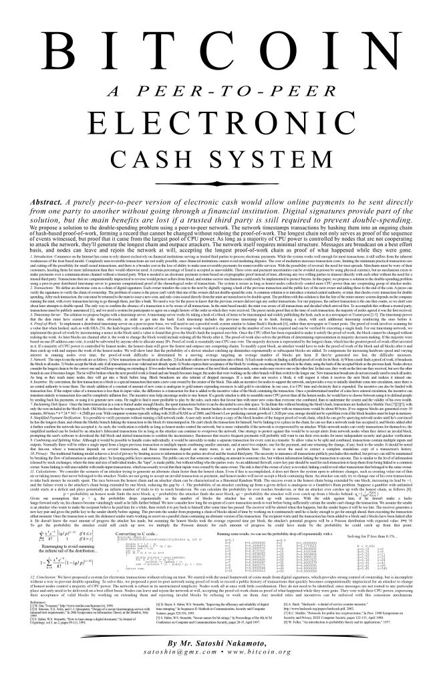


El whitepaper titulado **"Bitcoin: A Peer-to-Peer Electronic Cash System"**, publicado por *Satoshi Nakamoto* en 2008, propone una solución a un problema clave en los sistemas financieros digitales: **la necesidad de confianza en terceros (como bancos) para validar transacciones**.

####  Objetivo principal
Diseñar un **sistema de efectivo electrónico entre pares** (*peer-to-peer*), que permita enviar pagos directamente de una persona a otra sin pasar por una institución financiera.

####  Cómo lo logra

El documento introduce una combinación de:
- **Pruebas criptográficas**
- **Red descentralizada**
- **Cadena de bloques (blockchain)** como mecanismo de seguridad y verificación

Cada transacción se agrupa en un bloque, y los bloques se conectan mediante firmas digitales (hashes), formando una cadena inmutable que impide el doble gasto.

####  Innovaciones clave

- **Proof-of-Work (Prueba de Trabajo):** mecanismo para validar bloques sin un tercero.
- **Timestamp Server (Servidor de sellado de tiempo):** garantiza el orden de las transacciones.
- **Descentralización:** cualquier usuario puede verificar, sin confiar en una autoridad central.
- **Inmutabilidad:** una vez validadas, las transacciones no se pueden modificar.

####  Solución al “doble gasto”

Uno de los principales logros del whitepaper es prevenir que alguien gaste las mismas monedas más de una vez. Esto se resuelve mediante un **registro público distribuido** (blockchain), donde todos los nodos de la red verifican el historial de transacciones.

####  Recompensas y minería

El documento describe cómo los nodos pueden generar nuevos bitcoins mediante un proceso llamado **minería**, recibiendo recompensas por encontrar nuevos bloques válidos.

####  Conclusión

Satoshi concluye que Bitcoin es una alternativa robusta y práctica al sistema bancario digital tradicional. Se puede usar en línea, sin intermediarios, y se basa totalmente en **matemáticas, criptografía y consenso descentralizado**.

### CRIPTOMONEDAS

Las criptomonedas son activos digitales que emplean la criptografía para asegurar las transacciones y gestionar la creación de nuevas unidades. Operan de forma descentralizada, sin depender de una autoridad central, y utilizan la tecnología blockchain para registrar y verificar todas las transacciones.


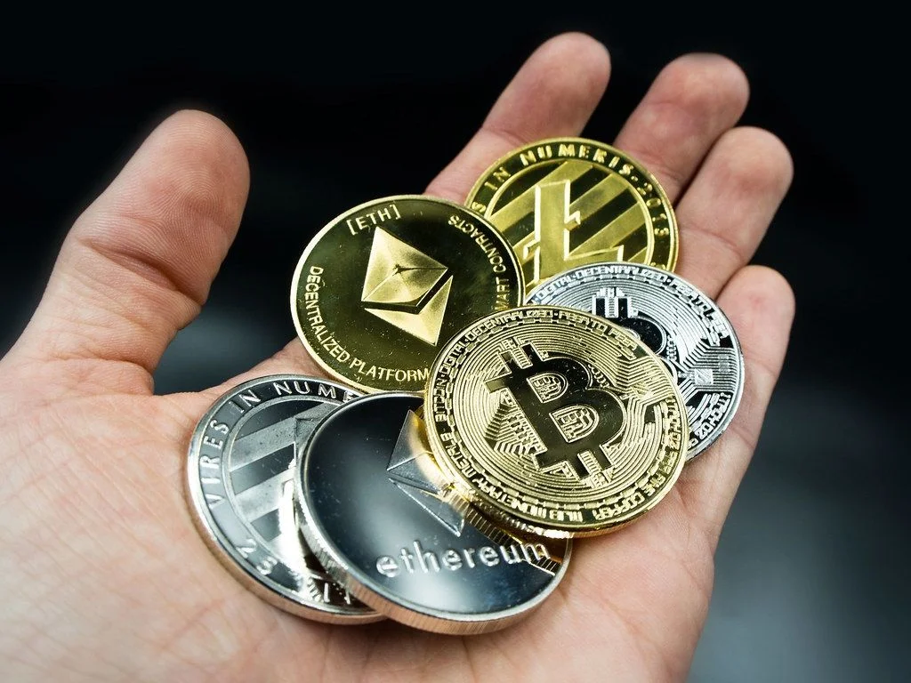


La primera criptomoneda, Bitcoin, fue presentada por Satoshi Nakamoto en 2008 como "una versión puramente peer-to-peer de efectivo electrónico que permitiría realizar pagos en línea directamente de una parte a otra, sin la intervención de una institución financiera".

Desde entonces, han aparecido miles de criptomonedas con diferentes usos, que van desde medios de intercambio hasta plataformas para contratos inteligentes y aplicaciones descentralizadas.


####  Decentraland: El Metaverso Descentralizado
Decentraland es una plataforma de realidad virtual descentralizada construida sobre la blockchain de Ethereum. Permite a los usuarios crear, experimentar y monetizar contenido y aplicaciones en un entorno 3D. Los terrenos virtuales, conocidos como "LAND", son tokens no fungibles (NFTs) que los usuarios pueden comprar, vender o desarrollar .

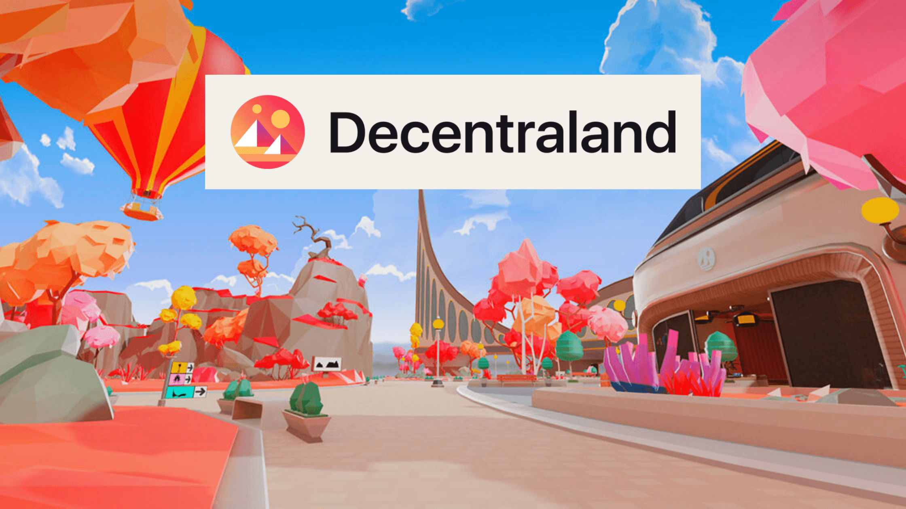

La economía de Decentraland se basa en su token nativo, MANA, que se utiliza para adquirir terrenos y bienes dentro del mundo virtual. La plataforma es gobernada por una organización autónoma descentralizada (DAO), lo que permite a los usuarios participar en decisiones clave sobre el desarrollo y las políticas del mundo virtual.


####  NFTs: Tokens No Fungibles
Los NFTs (Tokens No Fungibles) son activos digitales únicos que representan la propiedad de un objeto específico, ya sea digital o físico. A diferencia de las criptomonedas tradicionales, que son intercambiables entre sí, cada NFT tiene características distintivas que lo hacen único .


Los NFTs han ganado popularidad en áreas como el arte digital, los videojuegos y los coleccionables, permitiendo a los creadores monetizar su trabajo de nuevas formas. La autenticidad y propiedad de un NFT están garantizadas por la blockchain, lo que proporciona una forma segura y transparente de comerciar con activos digitales.


## DÓNDE COMPRAR {.tabset}

### ¿DÓNDE Y CÓMO COMPRAR CRIPTOMONEDAS?

**1. Plataformas populares para compra de criptomonedas:**

- **Binance:** Una de las plataformas más grandes del mundo. Permite comprar con tarjeta de débito, transferencia bancaria o criptomonedas. Es ideal para usuarios con experiencia.


- **Bitso:** Plataforma muy utilizada en México y América Latina. Permite comprar criptomonedas con pesos mexicanos. Es intuitiva y fácil para principiantes.

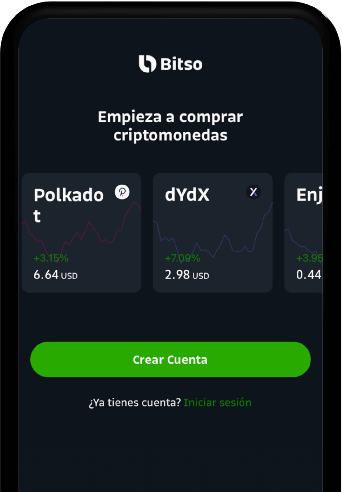


- **Coinbase:** Muy amigable para principiantes, disponible en varios países. Permite compras con tarjeta o transferencia.

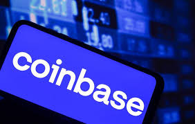


- **Kraken:** Plataforma avanzada para trading con alta seguridad. Admite múltiples criptos.

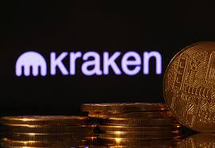


**2. Requisitos comunes para comprar:**

- Crear una cuenta en la plataforma (con correo y verificación de identidad - KYC).
- Asociar una forma de pago (tarjeta, cuenta bancaria, SPEI en México).
- Elegir la criptomoneda (por ejemplo, Bitcoin) y el monto a comprar.
- Confirmar la transacción.

**3. Ejemplo de flujo de compra en Bitso:**

```r
# Este es un flujo ilustrativo en texto, no código ejecutable en R
Paso 1: Crear cuenta en Bitso
Paso 2: Verificar tu identidad (INE, comprobante, selfie)
Paso 3: Depositar dinero (SPEI o tarjeta)
Paso 4: Buscar Bitcoin (BTC) y hacer la compra
```

---

### ¿DÓNDE Y CÓMO ALMACENAR CRIPTOMONEDAS?

**1. Carteras o wallets**

- **Exchange Wallet:** Wallet integrada en plataformas como Binance o Bitso. Es conveniente pero menos segura a largo plazo.
- **Hot Wallet (cartera caliente):** Aplicaciones móviles como Trust Wallet o MetaMask. Siempre conectadas a internet.
- **Cold Wallet (cartera fría):** Dispositivos físicos como Ledger o Trezor. Almacenan criptomonedas offline y son las más seguras.

**2. Recomendaciones de seguridad:**

- Nunca compartas tus llaves privadas.
- Usa doble autenticación (2FA).
- Guarda tus frases de recuperación (seed phrase) en papel y en un lugar seguro.

**3. Comparación rápida:**

| Tipo de Wallet     | Conectividad | Seguridad | Ideal para |
|--------------------|--------------|-----------|-------------|
| Exchange Wallet    | Online       | Media     | Principiantes |
| Hot Wallet         | Online       | Alta (si se protege bien) | Usuarios frecuentes |
| Cold Wallet        | Offline      | Muy alta  | Almacenamiento a largo plazo |


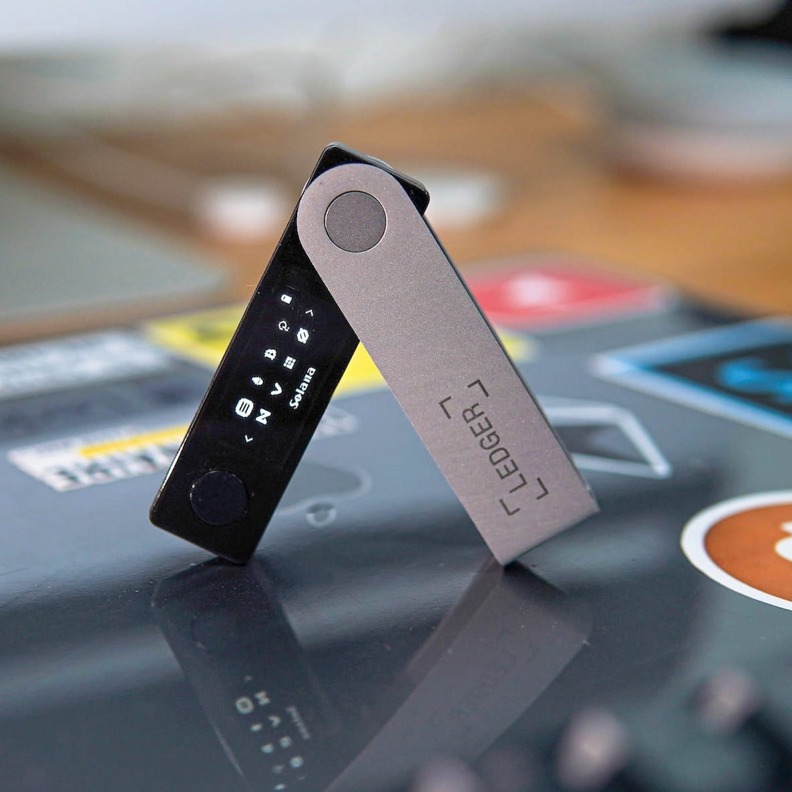


---

## ANÁLISIS ESTADÍSTICO DE BITCOIN CON R {.tabset}

### Web Scraping

#### Web Scraping: Precio actual, gráfico y tabla de Bitcoin

**¿Qué estamos haciendo?**

En esta sección aplicamos Web Scraping usando una API pública de CoinGecko para mostrar el **precio actual** de Bitcoin en tiempo real. Luego, descargamos precios históricos de los últimos 30 días desde Yahoo Finance y los visualizamos en un **gráfico de velas japonesas** y una **tabla comparativa de precios**. Esto permite un análisis visual y numérico del comportamiento reciente del mercado.

```{r web_api_btc, message=FALSE, warning=FALSE, results='asis'}
library(httr)
library(jsonlite)
url <- "https://api.coingecko.com/api/v3/simple/price?ids=bitcoin&vs_currencies=usd"
response <- GET(url)
data <- fromJSON(content(response, "text"))
precio_actual <- data$bitcoin$usd
fecha_hoy <- Sys.Date()
cat(sprintf('
<style>
@keyframes bluePulse {
  0%% { background-position: 0%% 50%%; }
  50%% { background-position: 100%% 50%%; }
  100%% { background-position: 0%% 50%%; }
}
.btc-banner {
  background: linear-gradient(270deg, #00aaff, #0077b6, #00aaff);
  background-size: 600%% 600%%;
  animation: bluePulse 8s ease infinite;
  color: white;
  padding: 20px;
  border-radius: 15px;
  text-align: center;
  font-size: 22px;
  font-weight: bold;
  box-shadow: 0 0 15px rgba(0, 170, 255, 0.6);
  max-width: 800px;
  margin: 20px auto;
}
</style>
<div class="btc-banner">
  🚀 Precio actual de Bitcoin al %s: <br><span style="font-size:26px;">$%s USD</span> 💰<br>
  <span style="font-size:16px; font-weight:normal;">(Fuente: CoinGecko | actualizado en tiempo real)</span>
</div>', format(fecha_hoy, "%d/%m/%Y"), format(precio_actual, big.mark = ",")))
```

<div style="background-color:red; color:white; padding:15px; border-radius:10px; font-weight:bold; font-size:16px;">
⚠️ <strong>¡Atención!</strong> Las siguientes gráficas son <u>dinámicas</u> e <u>interactivas</u>. Puedes mover el mouse sobre ellas para explorar los datos.
</div>

```{r, message=FALSE, warning=FALSE}
library(quantmod)
library(plotly)
library(lubridate)
suppressMessages(getSymbols("BTC-USD", src = "yahoo", from = Sys.Date() - 30, auto.assign = TRUE))
btc <- `BTC-USD`
df <- data.frame(
  Fecha    = index(btc),
  Apertura = as.numeric(Op(btc)),
  Alto     = as.numeric(Hi(btc)),
  Bajo     = as.numeric(Lo(btc)),
  Cierre   = as.numeric(Cl(btc))
)
plot_ly(data = df, x = ~Fecha, type = "candlestick",
        open = ~Apertura, close = ~Cierre,
        high = ~Alto, low = ~Bajo) %>%
  layout(title = "Bitcoin (USD) - Velas Japonesas (últimos 30 días)",
         xaxis = list(title = "Fecha"),
         yaxis = list(title = "Precio (USD)"))
```

```{r}
btc_data <- `BTC-USD`
df <- data.frame(
  Fecha = index(btc_data),
  Precio = as.numeric(Cl(btc_data))
)
plot_ly(df, x = ~Fecha, y = ~Precio, type = "scatter", mode = "lines+markers",
        line = list(color = 'blue')) %>%
  layout(title = "Precio de Bitcoin (USD) - Últimos 30 días",
         xaxis = list(title = "Fecha"),
         yaxis = list(title = "Precio (USD)"))
```

```{r tabla_bitcoin, message=FALSE, warning=FALSE}
library(knitr)
tabla <- data.frame(
  Fecha = format(index(btc_data), "%d/%m/%Y"),
  Apertura = round(Op(btc_data), 2),
  Máximo = round(Hi(btc_data), 2),
  Mínimo = round(Lo(btc_data), 2),
  Cierre = round(Cl(btc_data), 2)
)
tabla <- tail(tabla, 15)
kable(tabla, caption = "Comparativa de precios de Bitcoin en los últimos 15 días")
```


```{r anova_completo, message=FALSE, warning=FALSE, results='asis'}
library(dplyr)
library(ggplot2)
library(knitr)
library(lubridate)

# Introducción ANOVA
cat("### ANOVA: ¿El precio de Bitcoin varía según el día?\n\n")
cat("**¿Qué es ANOVA y para qué sirve?**  
El análisis de varianza (ANOVA) permite comparar las medias de tres o más grupos para determinar si existen diferencias significativas entre ellos.  
En este análisis, evaluamos si el precio de Bitcoin ha variado de forma significativa a lo largo de los últimos días.\n\n")

# Simulación de datos
set.seed(123)
dias <- rep(seq(Sys.Date() - 6, Sys.Date(), by = "day"), each = 5)
precios <- round(rnorm(35, mean = rep(seq(27000, 31000, length.out = 7), each = 5), sd = 1500), 2)
df <- data.frame(Fecha = dias, Precio = precios)
df$Dia <- format(df$Fecha, "%d/%m/%Y")

# ANOVA
modelo <- aov(Precio ~ Dia, data = df)
resumen <- summary(modelo)
valor_p <- resumen[[1]]$`Pr(>F)`[1]
tabla_anova <- as.data.frame(resumen[[1]])
colnames(tabla_anova) <- c("Grados de libertad", "Suma de cuadrados", "Media cuadrática", "F", "Valor p")
tabla_anova$`Valor p` <- formatC(tabla_anova$`Valor p`, format = "e", digits = 2)

# Tabla ANOVA
cat("**Tabla ANOVA: análisis del precio de Bitcoin entre días**\n\n")
print(kable(tabla_anova, format = "html"))

# Valor p y conclusión
cat(sprintf('<br><span style="color:red; font-weight:bold;">Valor p obtenido: <strong>%s</strong></span><br><br>', format(valor_p, scientific = TRUE, digits = 3)))
if (valor_p < 0.05) {
  cat("**Conclusión del análisis ANOVA:** Existe evidencia estadística suficiente para afirmar que el precio promedio de Bitcoin **varía significativamente** entre los diferentes días analizados. Esto indica que el día tiene un efecto importante sobre el precio registrado.\n\n")
} else {
  cat("**Conclusión del análisis ANOVA:** No se encontraron diferencias estadísticamente significativas entre los precios promedio de Bitcoin por día. Esto sugiere que el precio no varió de forma relevante según la fecha.\n\n")
}

# Estadísticas descriptivas
resumen_stats <- df %>%
  group_by(Dia) %>%
  summarise(Media = mean(Precio), `Desviación estándar` = sd(Precio), Mínimo = min(Precio), Máximo = max(Precio))
cat("**Estadísticas descriptivas del precio de Bitcoin por día**\n\n")
print(kable(resumen_stats, format = "html"))

# Gráfico
print(
  ggplot(df, aes(x = Dia, y = Precio)) +
    geom_boxplot(fill = "lightgreen", color = "black") +
    labs(title = "Boxplot del precio de Bitcoin por día",
         x = "Fecha (dd/mm/yyyy)", y = "Precio (USD)") +
    theme_minimal() +
    theme(axis.text.x = element_text(angle = 90, hjust = 1))
)


```

**En dado de no cumplirse la condición if (p < 0.05) nuestra conclusión  del análisis ANOVA: No se encontraron diferencias estadísticamente significativas entre los precios promedio de Bitcoin por día. Esto sugiere que el precio no varió de forma relevante según la fecha**

### CHI CUADRADO

```{r chi_bitcoin, message=FALSE, warning=FALSE}
df <- df %>%
  arrange(Fecha) %>%
  mutate(
    Cambio = Precio - lag(Precio),
    Direccion = ifelse(Cambio > 0, "Sube", "Baja"),
    DiaSemana = weekdays(Fecha),
    FechaLabel = format(Fecha, "%d/%m/%Y")
  ) %>%
  filter(!is.na(Direccion))
tabla_chi <- table(df$DiaSemana, df$Direccion)
chi_result <- chisq.test(tabla_chi)
```

```{r mostrar_valor_p_chi, results='asis', echo=FALSE, message=FALSE, warning=FALSE}
cat(sprintf('<span style="color:red; font-weight:bold;">Valor p de Chi-cuadrado: <strong>%s</strong></span><br><br>', format(chi_result$p.value, scientific = TRUE, digits = 3)))
```

```{r chi_plot, message=FALSE, warning=FALSE, echo=FALSE}
library(ggplot2)
df_chi <- df %>%
  mutate(DiaFecha = paste(DiaSemana, FechaLabel, sep = " - ")) %>%
  count(DiaFecha, Direccion) %>%
  rename(Frecuencia = n)
ggplot(df_chi, aes(x = reorder(DiaFecha, DiaFecha), y = Frecuencia, fill = Direccion)) +
  geom_bar(stat = "identity", position = "dodge") +
  labs(title = "Frecuencia de Subidas y Bajadas de Bitcoin por Día",
       x = "Día - Fecha", y = "Frecuencia") +
  theme_minimal() +
  theme(axis.text.x = element_text(angle = 45, hjust = 1))
```

```{r tabla_chi, results='asis', echo=FALSE}
tabla_chi_df <- df %>%
  group_by(DiaSemana, FechaLabel, Direccion) %>%
  summarise(Frecuencia = n(), .groups = 'drop')
kable(tabla_chi_df[order(tabla_chi_df$FechaLabel), ] %>% 
  rename(DÍA = DiaSemana, Fecha = FechaLabel), 
  caption = "Tabla de contingencia: Dirección del precio por día y fecha")
```


---

## Referencias {.tabset}

### Bibliografía

- Nakamoto, S. (2008). *Bitcoin: A Peer-to-Peer Electronic Cash System*.
- Tapscott, D., & Tapscott, A. (2016). *Blockchain Revolution: How the Technology Behind Bitcoin Is Changing Money, Business, and the World*. Penguin.
- Mougayar, W. (2016). *The Business Blockchain: Promise, Practice, and the Application of the Next Internet Technology*. Wiley.
- Swan, M. (2015). *Blockchain: Blueprint for a New Economy*. O’Reilly Media.
- CoinDesk. (s.f.). *Bitcoin Price*. Obtenido de https://www.coindesk.com/price/bitcoin/
- Yahoo Finance. (s.f.). *Bitcoin USD (BTC-USD)*. Obtenido de https://finance.yahoo.com/quote/BTC-USD
- Binance. (s.f.). *Guía de inicio rápido para comprar criptomonedas*. Obtenido de https://www.binance.com
- Bitso. (s.f.). *¿Cómo comprar Bitcoin?*. Obtenido de https://bitso.com
- Coinbase. (s.f.). *Cómo comprar criptomonedas en Coinbase*. Obtenido de https://www.coinbase.com
- Kraken. (s.f.). *Tutoriales y soporte de compra*. Obtenido de https://www.kraken.com
- Ledger. (s.f.). *Ledger Wallets*. Obtenido de https://www.ledger.com
- Trezor. (s.f.). *Trezor Official Website*. Obtenido de https://trezor.io
- MetaMask. (s.f.). *Wallet de Ethereum y navegador Web3*. Obtenido de https://metamask.io
- Trust Wallet. (s.f.). *Segura y fácil de usar*. Obtenido de https://trustwallet.com

### Whitepaper

> 💡 Puedes consultar el documento original aquí:  
> 📄 [Whitepaper de Bitcoin (PDF)](https://bitcoin.org/bitcoin.pdf)

### Fuentes por tema

**Para análisis estadístico y gráficos en R:**

- R Documentation. (s.f.). *ggplot2, dplyr, knitr, plotly, lubridate, quantmod, chisq.test*. Obtenido de https://www.rdocumentation.org/

**Para precios en tiempo real y análisis financiero:**

- Yahoo Finance – https://finance.yahoo.com/quote/BTC-USD  
- CoinDesk – https://www.coindesk.com/price/bitcoin/

**Para compra de criptomonedas:**

- Binance – https://www.binance.com  
- Bitso – https://bitso.com  
- Coinbase – https://www.coinbase.com  
- Kraken – https://www.kraken.com

**Para almacenamiento de criptomonedas:**

- Ledger – https://www.ledger.com  
- Trezor – https://trezor.io  
- MetaMask – https://metamask.io  
- Trust Wallet – https://trustwallet.com


